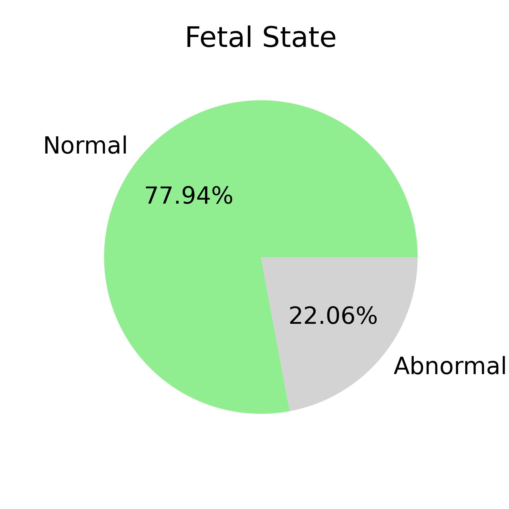
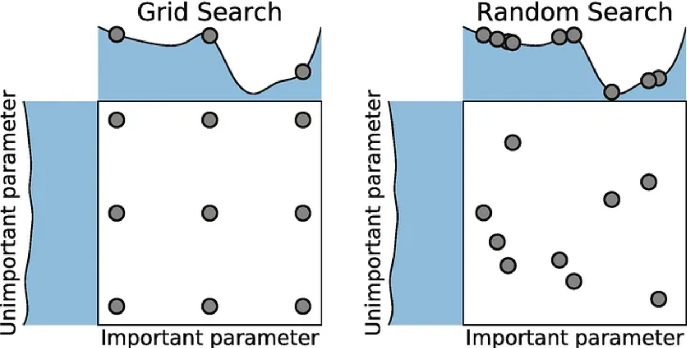
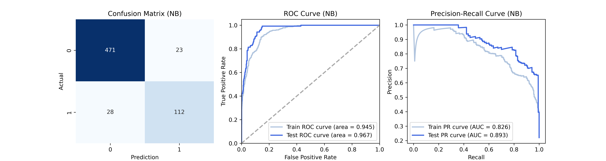
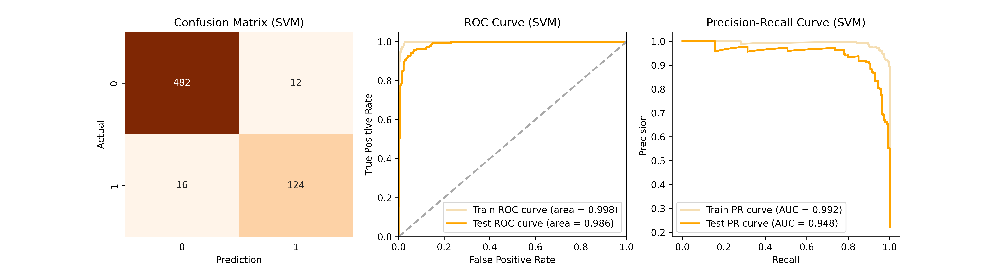
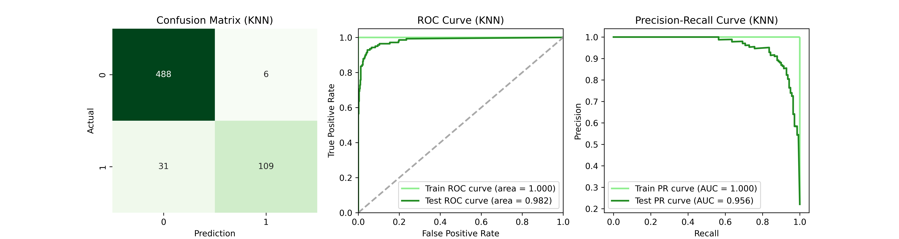
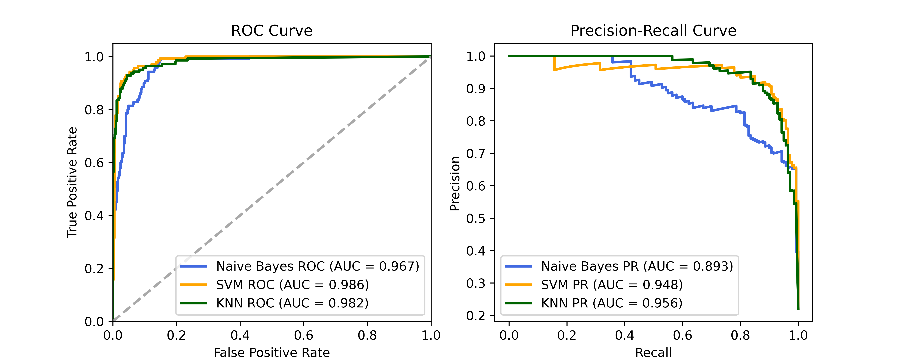
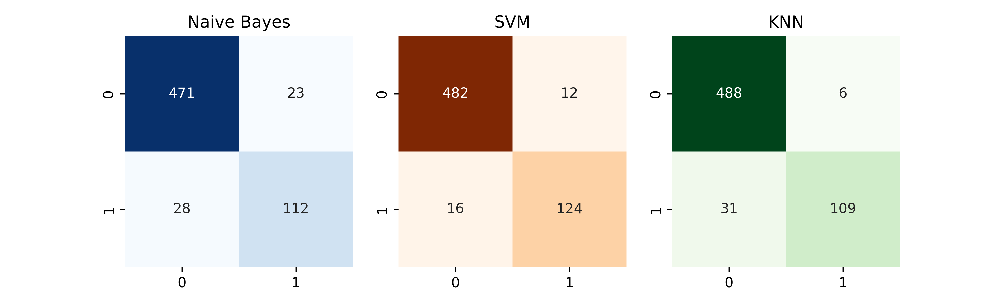

[Go back to the Projects List](https://mjimenezj.github.io/Portfolio/Projects.html)

# 👶🏻🩺 Fetal Health Prediction During Childbirth

## Context

Reducing child mortality is a crucial goal outlined in several of the United Nations' Sustainable Development Goals (SDGs) and serves as a vital indicator of human development.

The UN aims to eliminate preventable deaths of newborns and children under 5 years of age by 2030. In parallel to the issue of child mortality, maternal mortality also remains a pressing concern.

In this context, Cardiotocograms (CTGs) offer a simple and cost-effective way to assess fetal health, providing healthcare professionals with vital data to help prevent both maternal and child mortality. The equipment works by emitting ultrasound pulses and analyzing the returned signals, providing insights into fetal heart rate (FHR), fetal movements, uterine contractions, and more.

A dataset of 2,126 CTGs has been collected, along with their respective diagnostic features. These CTGs were classified by three expert obstetricians, and a consensus classification label was assigned to each. The diagnostic features represent the set of variables that will be used to estimate the fetal condition (target) as either normal or abnormal.

## 🎯 Objective

To predict the fetal health status during childbirth using Supervised Classification Algorithms.

## Dataset Used

This project uses data published by **Ayres-de-Campos, *et al.*, (2000). *Journal of Maternal-Fetal Medicine*, 9(5), 311-318.**

The data is available [here](https://www.tandfonline.com/doi/abs/10.3109/14767050009053454), [here](https://www.kaggle.com/datasets/andrewmvd/fetal-health-classification) and [here](https://github.com/mjimenezj/Portfolio/blob/main/Projects/Project_1/fetal_health.csv).

## Machine Learning Algorithms

- Naive Bayes
- Support Vector Machine (SVM)
- K-nearest neighbors (KNN)

## 📋 Key Concepts

*EDA, Outliers, Binning, Winsorization, Stratified sampling, Data leakage, Hyperparameter Tunning, Stratified cross-validation, Overfitting.*

## Table of Contents 

1. [Exploratory Data Analysis (EDA)](#eda)
2. [Outliers Detection (IQR, Z-score) & Treatment](#outliers)
3. [Splitting the Dataset](#splitting)
4. [Feature Scaling](#scaling)
5. [Coarse-to-Fine Hyperparameter Tuning Search](#tuning)
6. [Models Training](#training)
    - 6.1. [Naive Bayes](#bayes)
    - 6.2. [Support Vector Machine (SVM)](#svm)
    - 6.3. [K-nearest Neighbors (KNN)](#knn)
7. [Overall Models Comparison](#comparison)
8. [Conclusions](#conclusions)

**Note**: From this point on, a brief summary of each section has been provided into this document. You can view the full code with all the details and comments here:📙[Project 1 - Jupyter Notebook](https://github.com/mjimenezj/Portfolio/blob/main/Projects/Project_1/Project_1.ipynb)

## 1. Exploratory Data Analysis (EDA) <a id="eda"></a>

The exploratory analysis reveals that there are 21 explanatory variables. All are quantitative, with either discrete or continuous values. The target variable 'Fetal_state' is binary, with 0 indicating a normal state and 1 indicating an abnormal state of the fetus. Its distribution is as follows:

<p align="center">  </p>

> The distribution is **imbalanced**, so it's important to keep this in mind when splitting the dataset to ensure a fair representation of both classes. 

The Pearson correlation coefficient has been calculated for the numerical variables of the dataset. The Pearson correlation coefficient measures the strength and direction of the linear relationship between two numerical variables ranging from -1 to 1. Correlation Matrix: 

<p align="center">  </p>

> The 3 explanatory variables with the highest correlation to `Fetal_state` are **`ASTV`** (Pearson Coef. = 0.49): percentage of time with abnormal short-term variability; **`ALTV`** (Pearson Coef. = 0.48): percentage of time with abnormal long-term variability and **`AC`** (Pearson Coef. = -0.37): number of accelerations per second, counted in discrete units. 
> On the other hand, it is worth noting that there are several strong correlations between independent variables.

## 2. Outliers detection (IQR, Z-score) & Treatement <a id="outliers"></a>

Outliers were detected with two methods:

- **IQR**: or interquartile range. The interquartile range is the central 50% of the data. If the data is divided into 4 equal portions or quartiles (Q1-Q4), the two central quartiles represent the IQR, i.e., IQR = Q3−Q1. This method considers any data points outside of 1.5 times the IQR from Q1 or Q3 as outliers, i.e., $[Q1−1.5×IQR, Q3+1.5×IQR]$.

- **Z-score**: This calculates how many standard deviations each value is from the mean. In other words, the mean will be at 0, the standard deviation at ± 1, and the values will be distributed in a range from +infinity to -infinity, being positive if greater than the mean and negative if less than the mean. It is common to use a threshold of ± 3 to detect outliers.

**FEATURE TRANSFORMATION**

After outliers were detected, some variables were transfored by one of the following methods:
- Logarithmic transformation
- Root square
- Binning
- Winsorization

This is a comparison before vs after data transformation. The threshold are the vertival red lines (Z-score = +-3):

<p align="center">  </p>

> The data transformation have drastically reduced the number of outliers present in the data.

## 3. Splitting the Dataset <a id="splitting"></a>

Before training the algorithms, it is necessary to split the data into Training and Test sets. 

The following split has been chosen:
- Training set size = **70%**
- Test set size = **30%**

Additionally, **stratified sampling** has been applied to ensure that the target variable, which is imbalanced (as detected in the EDA), is proportionally represented in both the training and test sets.

```
# Splitting into explanatory variables (X) and Fetal_state (y)
X = data_transformed.drop('Fetal_state', axis=1)
y = data_transformed['Fetal_state']

# Splitting into Train and Test sets
X_train, X_test, y_train, y_test = train_test_split(X, y, test_size = 0.30, stratify = y, random_state = 0)
```

## 4. Feature scaling <a id="scaling"></a>

Feature scaling in machine learning is a crucial step in data pre-processing before building a model. Proper scaling can significantly impact the performance of a model, making the difference between a weak and a strong one. Since KNN and SVM are based on the distances between points, it will be essential to scale the variables so that all data is within the same range. To achieve this, the decision was made to remove the mean and set the standard deviation to 1, meaning that the Z-score has been calculated through the `StandardScaler()` from sklearn:

*You can read more about different scalers in https://scikit-learn.org/stable/modules/preprocessing.html*

> Note: **Data Leakage** occurs when information from the test set or future data influences the model during training, leading to unrealistic results and biased model evaluation. This happens when the model has access to data it shouldn't, such as performing preprocessing (e.g., feature scaling) before splitting the dataset, or including features that are improperly correlated with the target.

> Avoiding data leakage is crucial for obtaining an accurate evaluation of the model's performance on unseen data and **this is why Feature Scaling should be made after splitting the dataset**

```
# The scaler object is defined
scaler = StandardScaler().fit(X_train)

# Transformation
standardized_X_train = scaler.transform(X_train)
standardized_X_test = scaler.transform(X_test)
```


## 5. Coarse-to-Fine Hyperparameter Tuning Search <a id="tuning"></a>

Using `RandomizedSearchCV` followed by `GridSearchCV` methods from sklearn [(learn more)](https://scikit-learn.org/stable/auto_examples/model_selection/plot_randomized_search.html) is an effective strategy for hyperparameter optimization with a "coarse to fine" search approach:

1. **First, RandomizedSearchCV is used**:
   - RandomizedSearchCV explores a wide range of hyperparameter values by testing random combinations within a defined space.
   - This helps perform the **coarse search**, quickly covering a large search space.

2. **Then, GridSearchCV is used**:
   - Once promising ranges of hyperparameters are identified, **GridSearchCV** performs an exhaustive search over those narrowed-down values.
   - This is ideal for **fine search**, ensuring precise tuning of hyperparameters.

This combination maximizes efficiency and helps in finding the optimal model configuration.


<p align="center">  </p>

> Image Source: Bergstra, J., Bengio, Y.: Random search for hyper-parameter optimization. Journal of Machine Learning Research 13, 281–305 (2012)


In addition, during the Hyperparameter search, stratified cross-validation is used with `StratifiedKFold()`  [(link)](https://scikit-learn.org/stable/modules/generated/sklearn.model_selection.StratifiedKFold.html). Stratified K-Fold is a variation of K-Fold cross-validation that ensures each fold of the dataset has the same proportion of each target class as the entire dataset. This is particularly useful when dealing with imbalanced datasets (as this case), as it prevents the model from being biased toward overrepresented classes during training.

## 6. Models Training <a id="training"></a>

### 6.1. **Naive Bayes** <a id="bayes"></a>

Naive Bayes is a classification algorithm based on **Bayes' Theorem**, which is used to predict the probability of different classes based on the values of input features. It is called "naive" because it assumes that the features are independent of each other, which is a simplifying assumption that doesn't always hold in real-world data. Despite this assumption, Naive Bayes often performs surprisingly well.

Hyperparameters (Gaussian Naive Bayes):

- `var_smoothing`:
  - This parameter adds a small value to the variance of each feature to avoid division by zero or very small numbers in the Gaussian probability formula. 
  - Typical values: values in the range of `1e-9` to `1e0`.

```
# Best params
gnb = GaussianNB(var_smoothing = 0.2)
```
**Results**

<p align="center">  </p>


```
============ Metrics for NB ============
ROC-AUC Training Set: 	0.9445296523517384
ROC-AUC Test Set: 	0.9670040485829958
PR-AUC Training Set: 	0.8258362343983097
PR-AUC Test Set: 	0.8926223531912151
F1-score Training Set: 	0.7411003236245954
F1-score Test Set: 	0.8145454545454546
----------
Accuracy Test Set: 	0.919558359621451
Precision Test Set: 	0.8296296296296296
Recall Test Set: 	0.8
Specificity Test Set: 	0.9534412955465587
Trainig time (seconds): 0.003999233245849609
```

> **COMMENTS**:  
>
>1. **Overall Performance**:  the model demonstrates strong overall performance, as indicated by the high ROC-AUC score for the test set (**0.96**). **Accuracy** is also high at **91.96%**, meaning the model correctly classifies most instances. 
>
> 2. **Generalization and Overfitting**:  the comparison between training and test metrics suggests that the model **generalizes well** and **the model is not overfitted**.  
>
> 3. **Balance Between Precision and Recall**: the model maintains a good trade-off between correctly identifying positives and avoiding false positives.


### 6.2. **Support Vector Machine (SVM)** <a id="svm"></a>

Support Vector Machine (SVM) is a supervised learning algorithm used for classification and regression tasks. It works by finding the optimal **hyperplane** that best separates different classes in a high-dimensional space. SVM is particularly effective for high-dimensional datasets and when there is a clear margin of separation between classes.  

Hyperparameters (SVM):  

- `C` (Regularization Parameter):  
  - Controls the trade-off between achieving a low error on the training set and maintaining a simpler decision boundary.  
  - Higher values of `C` aim for a stricter classification (fewer misclassifications) but may lead to overfitting.  
  - Typical values: `0.01` to `100`.  

- `kernel`:  
  - Defines how the input data is transformed into a higher-dimensional space.  
  - Common choices: `'linear'`, `'poly'`, `'rbf'`, `'sigmoid'`.  
  - `'rbf'` (Radial Basis Function) is widely used for non-linear problems.  

- `gamma`:  
  - Relevant for non-linear kernels like `'rbf'` and `'poly'`. It controls the influence of each training example.  
  - Small values mean a broader influence, while larger values focus on individual points.  
  - Typical values: `1e-4` to `1e1`.  

```
# Best params
svm = SVC(C = 12.5, gamma = 0.05, probability = True)
```
**Results**

<p align="center">  </p>


```
============ Metrics for SVM ============
ROC-AUC Training Set: 	0.9980948044478527
ROC-AUC Test Set: 	0.9861336032388665
PR-AUC Training Set: 	0.9917288103943926
PR-AUC Test Set: 	0.9481783759569237
F1-score Training Set: 	0.9567901234567902
F1-score Test Set: 	0.8985507246376812
----------
Accuracy Test Set: 	0.9558359621451105
Precision Test Set: 	0.9117647058823529
Recall Test Set: 	0.8857142857142857
Specificity Test Set: 	0.9757085020242915
Training time (seconds): 0.271578311920166
```

> **COMMENTS**:  
> 
> 1. **Overall Performance**: The model exhibits outstanding performance, as demonstrated by the high ROC-AUC scores for the test set (0.9861). The accuracy on the test set is also impressive at 95.58%, indicating that **the model correctly classifies the majority of instances**. 
> 
> 2. **Generalization and Overfitting**: The model shows a high level of generalization based on the comparison of training and test metrics and is not overfitting.
> 
> 3. **Balance Between Precision and Recall**: the model achieves a good trade-off between minimizing false positives and false negatives.


### 6.3. **K-Nearest Neighbors (KNN)** <a id="knn"></a>

K-Nearest Neighbors (KNN) is a non-parametric, instance-based learning algorithm used for classification and regression. It classifies new data points based on the majority class of their K nearest neighbors in the feature space.  KNN is simple, intuitive, and effective when decision boundaries are non-linear. However, it can be computationally expensive for large datasets since it requires storing all training samples and computing distances for each new prediction.  

Hyperparameters:  

- `n_neighbors` (K):  
  - Defines the number of neighbors considered when making a prediction.  
  - Smaller values lead to more flexible decision boundaries but may cause overfitting.  
  - Typical values: `3` to `50`.  

- `weights`:  
  - Determines how neighbors contribute to the final prediction.  
  - `'uniform'`: All neighbors have equal influence.  
  - `'distance'`: Closer neighbors have a greater impact.  

- `metric`:  
  - Specifies the distance function used to find the nearest neighbors.  
  - Common choices: `'euclidean'`, `'manhattan'`, `'minkowski'`.  
  - `'euclidean'` is most commonly used for continuous data.
 
```
# Best params
knn = KNeighborsClassifier(metric='manhattan', n_neighbors=11, weights='distance')
```

**Results**

<p align="center">  </p>

```
============ Metrics for KNN ============
ROC-AUC Training Set: 	0.9999986686264485
ROC-AUC Test Set: 	0.9823163678426836
PR-AUC Training Set: 	0.9999906193129585
PR-AUC Test Set: 	0.9559942911480656
F1-score Training Set: 	0.9984639016897081
F1-score Test Set: 	0.8549019607843137
----------
Accuracy Test Set: 	0.9416403785488959
Precision Test Set: 	0.9478260869565217
Recall Test Set: 	0.7785714285714286
Specificity Test Set: 	0.9878542510121457
Training time (seconds): 0.30719900131225586
```

> **COMMENTS:**
> 
> 1. **Overall Performance**: the model performs well, with a high ROC-AUC (0.9823) and PR-AUC (0.9560) on the test set. However, **the recall is lower** (77.86%), suggesting that some positive cases are missed.
> 
> 2. **Generalization and Overfitting**: **the model shows signs of overfitting**, as the training ROC-AUC (0.9999) and PR-AUC (0.9999) are significantly higher than the test scores. The F1-score also drops from 0.998 in training to 0.8549 in testing, indicating that the model does not generalize perfectly and may benefit from hyperparameter tuning.
> 
> 3. **Balance Between Precision and Recall**: The model prioritizes precision (94.78%) over recall (77.86%), meaning it minimizes false positives but at the cost of missing some true positives (31 false negatives). 


## 7. Overall Models Comparison <a id="comparison"></a>

<p align="center">  </p>
<p align="center">  </p>


| **Metric**                    | **Naive Bayes**   | **SVM**           | **KNN**           |
|-------------------------------|-------------------|-------------------|-------------------|
| **ROC-AUC Test Set**           | 0.9670            | **0.9861**        | 0.9823            |
| **PR-AUC Test Set**            | 0.8926            | 0.9482            | **0.9560**        |
| **F1-score Test Set**          | 0.8145            | **0.8986**            | 0.8549        |
| **Accuracy Test Set**          | 0.9196            | **0.9558**        | 0.9416            |
| **Precision Test Set**         | 0.8296            | 0.9118            | **0.9478**        |
| **Recall Test Set**            | 0.8000            | **0.8857**        | 0.7786            |
| **Specificity Test Set**       | 0.9534            | 0.9757            | **0.9879**        |
| **Training time (seconds)**    | **0.0039**        | 0.2715            | 0.3071           |

> Best metrics are highlighted in bold

## 8. Conclusions <a id="conclusions"></a>

In the case of 👶🏻🩺 Fetal Health Prediction, recall is crucial because **it's mandatory to minimize the number of false negatives**, in order to avoid babies with an abnormal condition not being treated at time.  Given this context, even though the KNN model seems the most promising, its **recall**  is the lowest of the three, making it to miss a significant number of positive cases. For this reason, **SVM is the most appropriate model** for the task due to its superior recall and excellent performance across other metrics like ROC-AUC.


**Final Thoughts:**

- For **real-time diagnosis**, **Naive Bayes** is clearly faster and also well balanced. Although the difference in time might not seem significant, in cases where larger models when more data are used, and on smaller machines, this speed advantage could become substantial. **Naive Bayes**'s simplicity and efficiency make it a great choice for time-sensitive applications where computational resources might be limited.

- In any case, it is important to emphasize that one algorithm is not always a better option than the other. **Depending on the problem to be solved**, the type of data, the number of variables, the adjustment of hyperparameters, as well as the available time and computational capacity, will play a decisive role in choosing one method over another.


*I hope you enjoyed the reading as much as I did :)*

You can view the full code with more details and comments here:📙[Project 1 - Jupyter Notebook](https://github.com/mjimenezj/Portfolio/blob/main/Projects/Project_1/Project_1.ipynb)

Marcos.

[Go up](#context)
