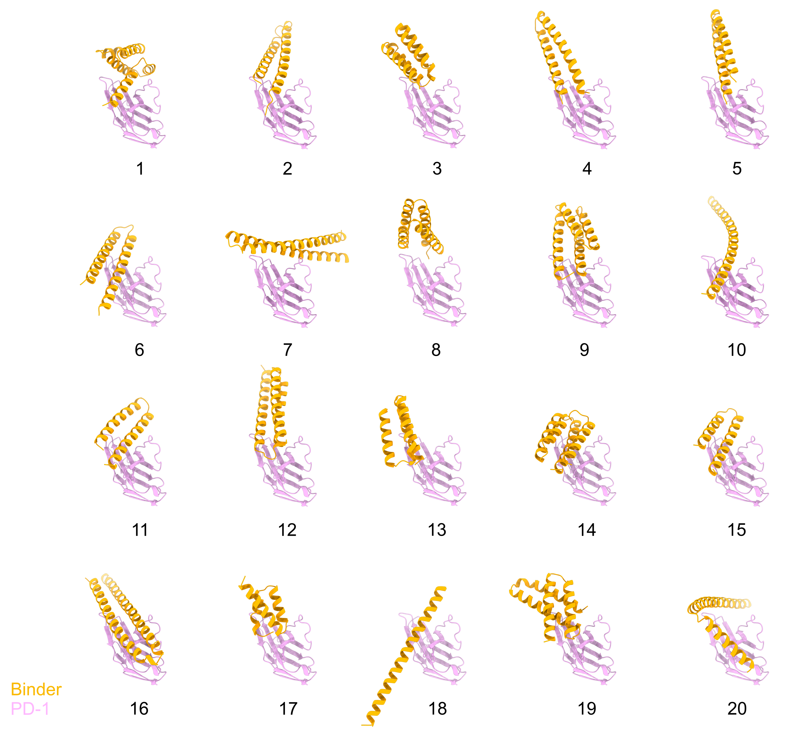
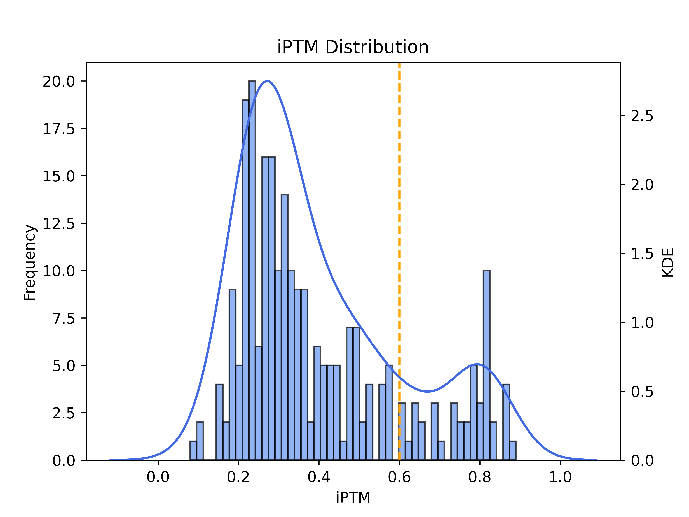
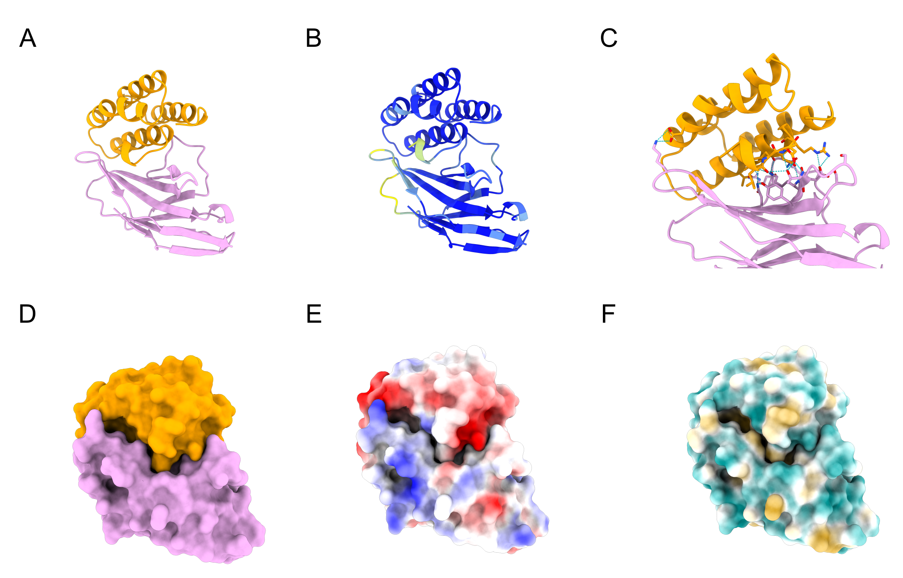

[Go back to the Projects List](https://mjimenezj.github.io/Portfolio/Projects.html)

# 🔬🧬 *De novo* Protein Design - Binder for PD-1

## Context

[PD-1](https://www.uniprot.org/uniprotkb/Q15116/entry) (Programmed Cell Death Protein 1) is a key protein in regulating the immune response. The design of specific binders for this molecule has great potential in the development of new immunotherapeutic therapies.

- It is a receptor found on the surface of activated T cells. 

- It negatively regulates the immune system to prevent excessive immune attacks on healthy tissues.

- When PD-1 binds to its ligand PD-L1, an inhibitory signal is activated, suppressing the immune system by reducing the proliferation and activity of T cells.

- Tumors can exploit this mechanism to evade the immune system by expressing high levels of PD-L1.

<p align="center">  </p>

> Image Source: Oliveira, A. F., Bretes, L., & Furtado, I. (2019). Review of PD-1/PD-L1 inhibitors in metastatic dMMR/MSI-H colorectal cancer. *Frontiers in Oncology*, 9, 396.

## 🎯 Objective

**To generate a new protein binder to PD-1 in order to disrupt the PD-1/PD-L1 interaction**, thereby reactivating the antitumor immune response.


## Software

- RosettaFold Diffusion
- ProteinMPNN
- AlphaFold 3
- Linux/Bash
- Python
- UCSF Chimera X

## 🔀 Workflow

<p align="center">  </p>

## Table of Contents 

1. [Preparing the PD-1 structure](#pd1)
2. [Backbone Generation](#bone)
 	- 2.1. [Hotspots Selection](#hotspot)
  	- 2.2. [Setting up RFDiffusion](#settingRFD)
   - 2.3. [RFDiffusion Backbone Generation](#truebackbone)
   - 2.4. [Filtering by Radius of Gyration](#rog)
3. [Sequence Optimization](#mpnn)
   - 3.1. [Setting up ProteinMPNN](#settingMPNN)
   - 3.2. [Sequence Optimization with ProteinMPNN](#seqopt)
   - 3.3. [Parsing FASTA files and Filtering by Score](#filtering)
4. [Structure generation with AlphaFold 3](#af3)
5. [Second Round and Final Model](#2nd)


## 1. Preparing the PD-1 structure <a id="pd1"></a>

PD-1 has an extracellular domain, a transmembrane region, and an intracellular (cytoplasmic) domain. The region of interest is the extracellular domain.

<p align="center">  </p>

The image shows the X-ray experimentally resolved structure, deposited in the Protein Data Bank (PDB_ID = [3RRQ](https://www.ebi.ac.uk/pdbe/entry/pdb/3rrq)). Since this structure presents two loops that have not been resolved with sufficient resolution (60-62 and 84-93), the structural prediction of this domain has been carried out using AlphaFold 3.

### AlphaFold 3 prediction of the extracellular domain of PD-1

The 35-145 region is annotated in [UniProt](https://www.uniprot.org/uniprotkb/Q15116/entry) as the PD-1 interacting domain. This sequence has been used as input in [AlphaFold 3](https://alphafoldserver.com/) (AF3) to generate 3D structure predictions:
```
> PD-1 (35-145)
PTFSPALLVVTEGDNATFTCSFSNTSESFVLNWYRMSPSNQTDKLAAFPEDRSQPGQDCRFRVTQLPNGRDFHMSVVRARRNDSGTYLCGAISLAPKAQIKESLRAELRVT
```

Predictions:
  
<p align="center">  </p>

Now we have a full structure of the region of interest. The [pTM](https://alphafoldserver.com/faq#how-can-i-interpret-confidence-metrics-to-check-the-accuracy-of-structures) of the Top 1 structure is 0.82 (Values higher than 0.8 represent confident high-quality predictions), so **the Top 1 Alphafold 3 prediction has been selected as the template PD-1 structure for the binder design**. 


## 2. Backbone generation <a id="bone"></a>

To generate a protein binder from scratch, [RosettaFold Diffusion](https://www.nature.com/articles/s41586-023-06415-8) (RFDiffusion) has been used, a generative AI-based diffusion method. In summary, it will generate the backbone of a protein structure starting from random Gaussian noise. It consists of three steps: (1) Introduction of initial noise, (2) Reverse diffusion, (3) Optimization and refinement.

### 2.1. Hotspots selection <a id="hotspot"></a>

To guide the binder design, 4 residues on the surface of the PD-1 extracellular domain have been selected as key residues for interaction with the binder. The selected residues are: `VAL 64`, `ALA 81`, `ILE 126`
 and `ILE 134`. 
 
<p align="center">  </p>


### 2.2. Setting up RFDiffusion <a id="settingRFD"></a>

Work has been performed on a Linux operating system. Ideally, RFDiffusion should be installed to work on GPU. However, I do not have these resources available, so it has been prepared to work on CPU instead. 


Cloning the repository:

```sh
git clone https://github.com/RosettaCommons/RFdiffusion.git
```

Downloading the models:
```sh
cd RFdiffusion && mkdir models && cd models
wget http://files.ipd.uw.edu/pub/RFdiffusion/6f5902ac237024bdd0c176cb93063dc4/Base_ckpt.pt
wget http://files.ipd.uw.edu/pub/RFdiffusion/e29311f6f1bf1af907f9ef9f44b8328b/Complex_base_ckpt.pt
wget http://files.ipd.uw.edu/pub/RFdiffusion/60f09a193fb5e5ccdc4980417708dbab/Complex_Fold_base_ckpt.pt
wget http://files.ipd.uw.edu/pub/RFdiffusion/74f51cfb8b440f50d70878e05361d8f0/InpaintSeq_ckpt.pt
wget http://files.ipd.uw.edu/pub/RFdiffusion/76d00716416567174cdb7ca96e208296/InpaintSeq_Fold_ckpt.pt
wget http://files.ipd.uw.edu/pub/RFdiffusion/5532d2e1f3a4738decd58b19d633b3c3/ActiveSite_ckpt.pt
wget http://files.ipd.uw.edu/pub/RFdiffusion/12fc204edeae5b57713c5ad7dcb97d39/Base_epoch8_ckpt.pt
```

Creating the conda environment:

```sh
conda create -n RFdiff python=3.9 numpy=1.21 -c conda-forge
```

```sh
conda activate RFdiff
```

Installing dependencies:
```sh
conda install -c dglteam dgl
```
```sh
pip install hydra-core pyrsistent
pip install e3nn==0.3.3 wandb==0.12.0 pynvml==11.0.0 decorator==5.1.0
pip3 install torch torchvision torchaudio --index-url https://download.pytorch.org/whl/cpu
```

Installing repository dependencies:
```sh
cd env/SE3Transformer
pip install --no-cache-dir -r requirements.txt
python setup.py install
cd ../..
pip install -e .
```


### 2.3. RFDiffusion Backbone Generation <a id="truebackbone"></a>

To generate the binder, the first step is to create the working folder and move the Top1 AF3 PD-1 prediction (in .pdb format) to the working folder:

Creating the working folder:
```sh
cd ~/ProgramFiles/RFdiffusion/myjobs
mkdir PD1_binders
```

Moving the Top1 AF3 PD-1 prediction to the working folder:

```sh
mv pd1_af3_top_1.pdb ~/ProgramFiles/RFdiffusion/myjobs/PD1_binders
```

The next step consists of creating a bash script with the desired parameter information:

```sh
touch script_pd1_binder.sh
vim script_pd1_binder.sh
```
Script content:

```sh
----------------------------------------------------------------------------------------------------------
../../scripts/run_inference.py \
        inference.output_prefix=results/pd1_binder \
        inference.input_pdb=pd1_af3_top_1.pdb \
        'contigmap.contigs=[A1-111/0 50-100]' \
        'ppi.hotspot_res=[A47,A30,A92,A100]' \
	denoiser.noise_scale_ca = 0.5 \
	denoiser.noise_scale_frame = 0.5 \
        inference.num_designs=20
----------------------------------------------------------------------------------------------------------
```
Description: 
- `contigmap.contigs=[A1-111/0 50-100]` indicates that the template is chain A of the input PDB and ranges from residue 1 to 111. It then specifies that the generated structure can have between 50 and 100 amino acids.
- `ppi.hotspot_res=[A47,A30,A92,A100]` indicates the positions of the previously selected hotspots within chain A of the input PDB. Note that the numbering is different because the AF3 prediction used as a template started at residue 35 of the protein, instead of 1.
- `inference.num_designs=20` indicates that 20 models will be generated. In the [original paper](https://www.nature.com/articles/s41586-023-06415-8) they generated ~10,000 RFdiffusion binder backbones for each target. They recommend genearating at least ~1,000 RFdiffusion backbones in order to pass pAE_interaction < 10. However, as I am working locally on my laptop, using CPU instead of GPU, and I want to publish this project in less than a year (😂), I will generate only 20 backbones. 
- `denoiser.noise_scale_ca = 0.5`  and `denoiser.noise_scale_frame = 0.5`. They have been consistently seen that reducing the noise added at inference improves designs in spite of diveristy. 0.5 for translations (`denoiser.noise_scale_ca`) and rotations (`denoiser.noise_scale_frame`) is a good compromise


Executing the script. The output is redirected to a .log archive and the calculations are performed in the background:

```sh
sh script_pd1_binder.sh > out_pd1_binder.log 2>&1 & 
```

Below is displayed the 50-step trajectory followed by RFDiffusion for generating the first model:

[](https://drive.google.com/file/d/153IqGIJ-CIi5wk6i_u-hEFB3jfszvEKG/view?usp=sharing)

Below are displayed all the generated models:

<p align="center">  </p>  

Two characteristics can be observed:  

- The first is that RFDiffusion tends to favor alpha-helices over beta-sheets. To change this behavior, the model `inference.ckpt_override_path=models/Complex_beta_ckpt.pt` can be used. However, it has not been extensively validated experimentally, so I have decided not to use it.  
- Second, not all structures will be valid as binders, as some are too elongated (i.e., model nº 10 or 18) and will not specifically bind to PD-1. Although with only 20 structures it is possible to filter visually the best ones, a criterion can be established. The **radius of gyration** is used to determine how compact a protein is, so let's use it.  

> **Note:** if desired, binders can be designed *a priori* by setting a radius of gyration threshold.  


### 2.4. Filtering by Radius of Gyration <a id="rog"></a>

The [radius of gyration](https://neurosnap.ai/blog/post/understanding-the-radius-of-gyration-in-protein-design-bioinformatics/66fb0ecc5a941760bf4b5138) is a measure that describes the distribution of a protein’s atoms around its center of mass. In simpler terms, it gives us a sense of how spread out a protein’s structure is. Mathematically, it’s the root-mean-square distance of all the atoms from the center of mass of the protein. If we think of proteins as being made up of many small points (atoms), the radius of gyration tells us how far these points are, on average, from the center.

For proteins, this measure is crucial because it helps quantify the overall shape and compactness of a folded protein structure. 

- A protein with a smaller radius of gyration is more compact, while a larger radius indicates a more extended or less folded structure.

Mathematically, the radius of gyration $R_g$ for a protein, represented as a collection of  atoms, is calculated using the following formula:

$$ R_g = \sqrt{\frac{1}{N} \sum_{i=1}^{N} r_i^2} $$

- $R_g$ is the radius of gyration.
- $N$ is the number of atoms in the protein.
- $r_i$ is the distance of each atom from the center of mass of the protein.

Let's calculate it using Python by parsing the PDBs generated by RFdiffusion with **`BioPython`**. The following code block is available in 📙[Jupyter Notebook - radius_of_gyration.ipynb](https://github.com/mjimenezj/test/blob/main/Project_2/Notebooks/radius_of_gyration.ipynb)

```python
import numpy as np
import pandas as pd
from Bio import PDB

def radius_of_gyration(structure_file_path):
    '''Calculates the radius of gyration using Bio.PDB'''

    # The model is parsed using the PDBParser
    parser = PDB.PDBParser(QUIET = True)
    structure = parser.get_structure("proteins", structure_file_path)
    model = structure[0]
    chain_A = model["A"] # The chain of the binder
    atoms = chain_A.get_atoms()
    
    # Get the coordinates of the atoms
    coords = np.array([atom.get_coord() for atom in atoms])
    # Calculate the center of mass
    com = np.mean(coords, axis=0)
    # Calculate the distances from the center of mass
    distances_from_com = np.linalg.norm(coords - com, axis=1)
    # Calculate the radius of gyration
    n_atoms = len(distances_from_com)
    rog_value = np.sqrt(np.sum(distances_from_com**2) / n_atoms)
    return rog_value

def get_num_residues(structure_file_path):
    '''Returns the number of residues in the structure'''
    
    # The model is parsed using the PDBParser
    parser = PDB.PDBParser(QUIET = True)
    structure = parser.get_structure("proteins", structure_file_path)
    model = structure[0]
    chain_A = model["A"] # The chain of the binder
    # Get the number of residues in chain A
    # This assumes that the chain is not empty and contains residues
    num_residues = len([residue for residue in chain_A.get_residues()])
    return num_residues

# List to store results
data = []
n_models = 20

# Iterate over the files
for i in range(1,n_models +1):
    pdb_file = f"PD1_binders/pd1_binder_{i}.pdb"  # Construct the file name
    rog_value = radius_of_gyration(pdb_file)      # Compute Rog
    num_residues = get_num_residues(pdb_file)     # Get number of residues
    data.append({
		"PDB_file": pdb_file.split('/')[1],
		"n_model": I,
		"Radius_of_gyration": rog_value,
		"Num_residues": num_residues
})

# Create a pandas DataFrame
data = pd.DataFrame(data)

#Save to a CSV file
#data.to_csv("radius_of_gyration_results.csv", index=False)

# Display the DataFrame
data = data.sort_values(by="Radius_of_gyration", ascending=True, ignore_index=True)
```

- Output:
  

| **Index** | **PDB_file**         | **n_model** | **Radius_of_gyration** | **Num_residues** |
|-----------|----------------------|-------------|------------------------|------------------|
| 0         | pd1_binder_17.pdb    | 17          | 10.732103              | 52               |
| 1         | pd1_binder_3.pdb     | 3           | 11.547195              | 83               |
| 2         | pd1_binder_13.pdb    | 13          | 11.680013              | 66               |
| 3         | pd1_binder_8.pdb     | 8           | 11.924329              | 84               |
| 4         | pd1_binder_14.pdb    | 14          | 12.244280              | 88               |
| 5         | pd1_binder_15.pdb    | 15          | 12.613170              | 50               |
| 6         | pd1_binder_1.pdb     | 1           | 13.152371              | 88               |
| 7         | pd1_binder_9.pdb     | 9           | 13.319784              | 96               |
| 8         | pd1_binder_11.pdb    | 11          | 13.662414              | 56               |
| 9         | pd1_binder_19.pdb    | 19          | 13.713561              | 98               |
| 10        | pd1_binder_4.pdb     | 4           | 14.926985              | 66               |
| 11        | pd1_binder_5.pdb     | 5           | 14.998361              | 65               |
| 12        | pd1_binder_6.pdb     | 6           | 15.848235              | 68               |
| 13        | pd1_binder_2.pdb     | 2           | 16.314045              | 71               |
| 14        | pd1_binder_12.pdb    | 12          | 16.469956              | 98               |
| 15        | pd1_binder_7.pdb     | 7           | 21.258490              | 97               |
| 16        | pd1_binder_18.pdb    | 18          | 21.734949              | 50               |
| 17        | pd1_binder_16.pdb    | 16          | 22.618574              | 98               |
| 18        | pd1_binder_20.pdb    | 20          | 23.078663              | 72               |
| 19        | pd1_binder_10.pdb    | 10          | 27.222211              | 64               |

- Graphical representation (see the code 📙[here](https://github.com/mjimenezj/test/blob/main/Project_2/radius_of_gyration.ipynb)):
  
<p align="center">  </p>

- The size of the binder (orange line) is not related to how compact the generated structure is, at least in this small set of 20 samples.  

- I have decided to set an arbitrary threshold of **Radius of Gyration < 14 angstroms** (gray dashed line in the graph), so I continue the pipeline with 50% of the generated binders.  


## 3. Sequence Optimization <a id="mpnn"></a>


The backbones of the binders generated by RFDiffusion are just backbones, so their sequence is `...GGGGGGGGGGGGGGGGGGGGG...`  and this is why their sequences need to be optimized. To achieve this, ProteinMPNN has been used. [**ProteinMPNN**](https://www.science.org/doi/10.1126/science.add2187) is a deep learning model designed for protein sequence design.

- It takes a protein structure (the already generated binder-template models) as input.

- It predicts amino acid sequences that can stably adopt that structure.


### 3.1. Setting up ProteinMPNN <a id="settingMPNN"></a>

Work has been performed on a Linux operating system. 


Cloning the repository:

```sh
git clone https://github.com/dauparas/ProteinMPNN.git
```

Creating the conda environment:

```sh
conda create --name mpnn
conda activate mpnn
```
Installind dependencies:
```sh
conda install pytorch torchvision torchaudio cudatoolkit=11.3 -c pytorch
```


## 3.2. Sequence Optimization with ProteinMPNN  <a id="seqopt"></a>


The next step consists of creating a bash script with the desired parameter information:

```sh
touch script_mpnn_binders.sh
vim script_mpnn_binders.sh
```
Script content:

```sh
----------------------------------------------------------------------------------------------------------
folder_with_pdbs="/home/marcos/ProgramFiles/ProteinMPNN/my_jobs/PD1_binder"   
output_dir="/home/marcos/ProgramFiles/ProteinMPNN/my_jobs/PD1_binder/outputs/"
if [ ! -d $output_dir ]
then
    mkdir -p $output_dir
fi

path_for_parsed_chains=$output_dir"/parsed_pdbs.jsonl"
path_for_assigned_chains=$output_dir"/assigned_pdbs.jsonl"
chains_to_design="A"

python /home/marcos/ProgramFiles/ProteinMPNN/helper_scripts/parse_multiple_chains.py --input_path=$folder_with_pdbs --output_path=$path_for_parsed_chains

python /home/marcos/ProgramFiles/ProteinMPNN/helper_scripts/assign_fixed_chains.py --input_path=$path_for_parsed_chains --output_path=$path_for_assigned_chains --chain_list "$chains_to_design"

python /home/marcos/ProgramFiles/ProteinMPNN/protein_mpnn_run.py \
        --jsonl_path $path_for_parsed_chains \
        --chain_id_jsonl $path_for_assigned_chains \
        --out_folder $output_dir \
        --num_seq_per_target 50 \
        --sampling_temp "0.1 0.2 0.3"
----------------------------------------------------------------------------------------------------------
```

Description:
- By default, it will use the recommended model `v_48_020.pt`, which utilizes 48 edges and 0.2 Gaussian noise ([read more](https://github.com/dauparas/ProteinMPNN)).
- For each of the 10 selected binders, it will generate 50 sequences as declared in `--num_seq_per_target 50`. Since there are 3 sampling temperatures `--sampling_temp "0.1 0.2 0.3"`, it will generate 50 x 3 = 150 sequences per binder.

The file is executed:

```sh
sh script_mpnn_binders.sh
```


### 3.3. Parsing FASTA files and Filtering by Score <a id="filtering"></a>

For each model, ProteinMPNN will generate a FASTA file with the sequences as follows:  

```
>pd1_binder_1, score=2.3859, global_score=2.0713, fixed_chains=['B'], designed_chains=['A'], model_name=v_48_020, git_hash=8907e6671bfbfc92303b5f79c4b5e6ce47cdef57, seed=254
GGGGGGGGGGGGGGGGGGGGGGGGGGGGGGGGGGGGGGGGGGGGGGGGGGGGGGGGGGGGGGGGGGGGGGGGGGGGGGGGGGGGGGGG
>T=0.1, sample=1, score=1.0818, global_score=1.4852, seq_recovery=0.0114
SSLEEAFRAQQEQQVRDLCDFADPAVRAAFAAASPAERAALRTAAAEVIARLLGEKDVAALRARLLAASLDELAALAAEALAAADAAA
>T=0.1, sample=2, score=1.1515, global_score=1.5254, seq_recovery=0.0227
SSIRQQFLQQQQEQVLRLMDFSDPAVREAFAAASPAERAARVTGAAYVIAELLGEKDVAALEARLKAASLDELAAIAKEALEKYQASL
>T=0.1, sample=3, score=1.0960, global_score=1.4819, seq_recovery=0.0227
SLISLQTRLDNLETVRRLMDFADPAVRAAAAAASPAERAALVLGAAYVMAALLGTADVAALAARLAAASLDERAAAAAAARAQAEAAA
...
```

In order to analyze the results, the FASTA files for each model were parsed, and the data was entered into a table, ranked by the proteinMPNN score (the lower, the better). **You can see the Python code for parsing here**: 📙[Jupyter Notebook - analysis_mpnn.ipynb](https://github.com/mjimenezj/test/blob/main/Project_2/Notebooks/analysis_mpnn.ipynb) 

- First rows of the Results for Binder 1:

| **Identifier** | **Sequence** | **Mutations** | **Count** | **Score** | **Global Score** | **Seq Recovery** | **Temperature** |
|----------------|-------------|---------------|-----------|-----------|------------------|------------------|-----------------|
| Sample_19 | SAIAAATAAANA... | G1S, G2A, G3I, G... | 1 | 0.9915 | 1.4480 | 0.0341 | 0.1 |
| Sample_46 | AAIAAATRAALA... | G1A, G2A, G3I, G... | 1 | 0.9994 | 1.4830 | 0.0114 | 0.1 |
| Sample_39 | SALAAAFAAARA... | G1S, G2A, G3L, G... | 1 | 1.0035 | 1.4662 | 0.0341 | 0.1 |
| Sample_13 | SSLAAAFRAELR... | G1S, G2S, G3L, G... | 1 | 1.0048 | 1.4577 | 0.0227 | 0.1 |
| Sample_27 | AALRAAHEAALR... | G1A, G2A, G3L, G... | 1 | 1.0119 | 1.4618 | 0.0227 | 0.1 |
| ...        | ...        | ...        | ...    | ...    | ...          | ...          | ... |

<p align="center">  </p>

- **The top 5 sequences with the best score (at the left of the red line) have been selected for each binder**. In the next step of the pipeline, 5 complex structures (PD1-binder) will be generated with AlphaFold 3 for each of the selected sequences.

-  The score range for each binder in this first round has been:
 
 | Binder    | Min Score | Max Score |
|-----------|-----------|-----------|
| binder_11 | 1.2107    | 1.6454    |
| binder_15 | 1.2060    | 1.5120    |
| binder_17 | 1.0480    | 1.4805    |
| binder_13 | 1.0591    | 1.4417    |
| binder_19 | 1.0029    | 1.3997    |
| binder_9  | 1.0201    | 1.3893    |
| binder_8  | 0.9004    | 1.3571    |
| binder_1  | 0.9915    | 1.3387    |
| binder_3  | 0.8549    | 1.2454    |
| binder_14 | 0.8913    | 1.1911    |

 

## 4. Structure generation with AlphaFold 3 <a id="af3"></a>

For the top 5 sequences of each binder, 5 structures of the PD1-binder complex have been generated using www.alphafoldserver.com. The structures have been analyzed with the following Python code: 📙[Jupyter Notebook - AF3_json_analyzer.ipynb](https://github.com/mjimenezj/test/blob/main/Project_2/Notebooks/af3_josn_parser.ipynb). The output `.csv` file can be explored [here](https://github.com/mjimenezj/test/blob/main/Project_2/extracted_pae_data.csv). The data has been filtered according to these metrics:  

**FILTERING**  

- `iPTM`: Confidence in the interaction between subunits of a protein complex. Ranges from 0 to 1. Values higher than 0.8 represent confident high-quality predictions, while values below 0.6 suggest a likely failed prediction. Since this is the first round, **a threshold of `iPTM >= 0.6` has been set**.
- `chain_iptm`: Confidence in the individual structure of each chain in a complex. > 0.8: Well-defined chain. < 0.5: Uncertain chain. A low value indicates that a chain may be poorly modeled or flexible. **A threshold of `chain_iptm_A > 0.5` has been set.** 
- `chain_pair_pae_min`: A low error indicates that the spatial relationship between the chains is reliable. This correlates with whether two chains interact and, in some cases, can be used to distinguish binders from non-binders. 0-2 Å: Accurate. > 5 Å: Doubtful. Models that meet the previous two criteria have been ranked from lowest to highest average `chain_pair_pae_min`.


 <p align="center">  </p>

- iPTM distribution. The orange line is set at `iPTM = 0.6`. 
 
**Filters:**
```python
# Filter the values with iPTM >= 0.6 and chain_iptm_A > 0.5.
df_filtered = df_results[(df_results["iptm"] >= 0.6) & (df_results["chain_ptm_A"] > 0.5)].copy()
df_filtered.sort_values(by=["chain_pair_pae_min_average"], ascending=True, inplace=True)
df_filtered
```
Output:
<p align="center">  </p>


Below are the structures for the best sequence from the top 3 binders:


<p align="center">  </p>

## 5. Second Round and Final Model <a id="2nd"></a>

The best structures of the three selected binders were passed back to ProteinMPNN. Since this process now starts from a more advanced stage, better results are expected. Steps:

- Generation of 150 sequences per model with ProteinMPNN:  

```bash
  python /home/marcos/ProgramFiles/ProteinMPNN/protein_mpnn_run.py \
        --jsonl_path $path_for_parsed_chains \
        --chain_id_jsonl $path_for_assigned_chains \
        --out_folder $output_dir \
        --num_seq_per_target 50 \
        --sampling_temp "0.1 0.2 0.3"
  ```

- Sequence Analysis. selection of the top 5 sequences per binder (as done in the first round).
- Generation of 5 structures for each sequence using AlphaFold 3. 

The structures have been analyzed with the following Python code: 📙[Jupyter Notebook - AF3_json_analyzer.ipynb](https://github.com/mjimenezj/test/blob/main/Project_2/Notebooks/af3_josn_parser.ipynb). The output `.csv` file can be explored [here](https://github.com/mjimenezj/test/blob/main/Project_2/extracted_pae_data_round_2.csv). 

**FILTERS**  

- `iPTM`: In this second round, **a threshold of `iPTM >= 0.8` has been set**.
- `chain_iptm`: **A threshold of `chain_iptm_A >= 0.8` has been set.** 
- `chain_pair_pae_min`: A low error indicates that the spatial relationship between the chains is reliable. This correlates with whether two chains interact and, in some cases, can be used to distinguish binders from non-binders. 0-2 Å: Accurate. > 5 Å: Doubtful. Models that meet the previous two criteria have been ranked from lowest to highest average `chain_pair_pae_min`.

 <p align="center">  </p>

- iPTM distribution. The orange line is set at the threshold set in the first round (`iPTM = 0.6`), and the red line is set at the threshold set in this second round (`iPTM = 0.8`). In this second round, significantly better metrics were obtained compared to the first round, with the average iPTM increasing from `0.36` in round 1 to `0.74` in round 2.  

**Filters:**
```python
# Filter the values with iPTM >= 0.8 and chain_iptm_A >= 0.8.
df_filtered = df_results[(df_results["iptm"] >= 0.8) & (df_results["chain_ptm_A"] >= 0.8)].copy()
df_filtered.sort_values(by=["chain_pair_pae_min_average"], ascending=True, inplace=True)
df_filtered
```
**WINNER**
<p align="center">  </p>

🏆 - The results clearly show that binder 15 is the winner.  

```
> PD1_binder_15_round_2_top_1_seq (50 aa)
NLIDKCVQEIDRLYNQAKAAADPEKKAQLDKKLQEQIAKCQKEIEEAKKK
```
Metrics:
```
| Metric                      | Best   					|
|-----------------------------|-----------------------------------------|
| name                        | fold_binder_15_round_2_top_1_model_0 	|
| iptm                        | 0.8    					|
| ptm                         | 0.86   					|
| chain_iptm_A                | 0.8    					|
| chain_iptm_B                | 0.8    					|
| chain_ptm_A                 | 0.73   					|
| chain_ptm_B                 | 0.85   					|
| chain_pair_pae_min_AB       | 1.34   					|
| chain_pair_pae_min_BA       | 1.48   					|
| chain_pair_pae_min_average  | 1.41   					|
```


 <p align="center">  </p>

 - `A`: ribbon representation of target PD-1 (pink) and best binder (orange).
 - `B`: PD1-binder complex colored by pLDDT.
 - `C`: closed look into PD1-binder polar interactions.
 - `D`: surface representation colored by domain.
 - `E`: surface representation colored by electrostatic potential.
 - `F`: surface representation colored by hydrophobicity.
 
The structural exploration shows an impressive fit between the binder and PD-1. In addition to several polar interactions (hydrogen bonds and salt bridges), the fit of polar and non-polar regions is remarkable.

This project ends here; however, it is important to take away several ✏️key insights:

- Ideally, it would be necessary to generate at least 1,000 binders and conduct multiple refinement rounds until converging on the best possible solution.
- In addition, several candidate binders should be experimentally purified in the lab to test whether the interaction occurs. Measurements such as Dissociation constant (KD) are key to determining this.  
- Metrics based on AlphaFold models (iPTM, pTM, pAE, pLDDT,...) have proven to be very useful, but there are also cases where a more rational design approach has performed better. For example, in a binder competition organized by *Adaptyv Bio*, the company *Cradle* achieved the best binder (with KD values in the nanomolar range). Instead of designing a binder from scratch, they used an antibody sequence as an initial template and kept the CDRs fixed. **This approach highlights the importance of exploring multiple methods to find optimal solutions** . Read more here: [Cradle - Optimizing Cetuximab](https://www.cradle.bio/blog/adaptyv2)


*I hope you enjoyed the project as much as I did :).*

- You can read more about PD1 here: 📚[Chamoto, K., Yaguchi, T., Tajima, M., & Honjo, T. (2023). Insights from a 30-year journey: function, regulation and therapeutic modulation of PD1. *Nature Reviews Immunology*, 23(10), 682-695.](https://doi.org/10.1038/s41577-023-00867-9)

- You can read more about binders design here: 📚[Watson, J. L., Juergens, D., Bennett, N. R., Trippe, B. L., Yim, J., Eisenach, H. E., ... & Baker, D. (2023). De novo design of protein structure and function with RFdiffusion. *Nature*, 620(7976), 1089-1100.](https://doi.org/10.1038/s41586-023-06415-8)

Marcos.


[Go up](#context)
