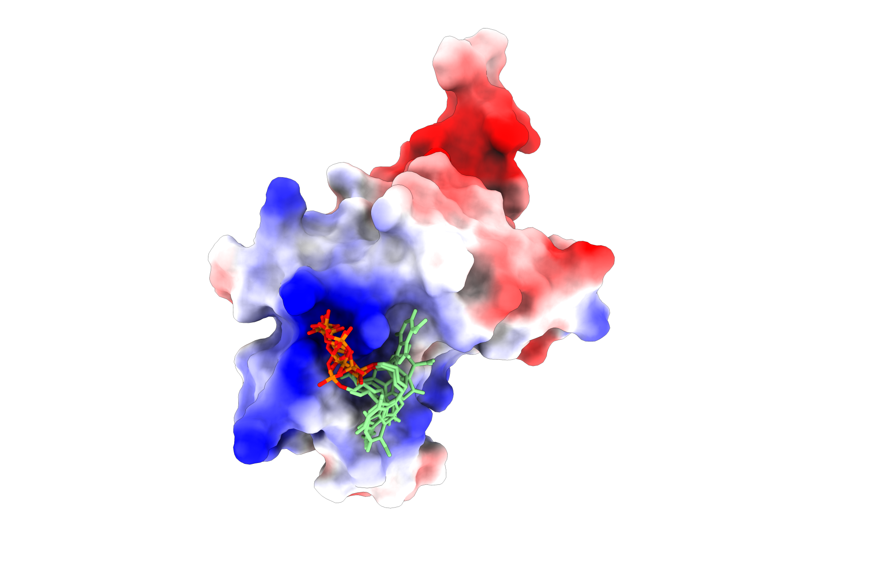

# Data Science Portfolio: Protein Design & ML for Drug Discovery  

Welcome to my Data Science Portfolio!

DisClaimer: This portfolio is always under construction.  

Aquí muestro buenos ejemplos de proyectos hechos enteramente por mí donde se aplican diferentes técnicas de ML para resolver problemas. El resumen de las técnicas se muestra en la portada, disfruten tanto como yo haciéndolo. 

where I showcase projects that merge my expertise in protein design with cutting-edge machine learning (ML) techniques for drug discovery. This repository highlights my ability to solve complex problems in the pharmaceutical industry by leveraging advanced computational methods.  

## What's inside?  

This portfolio includes carefully selected projects that demonstrate my skills and contributions in the following areas:  
- **Protein design:** ML-driven tools for predicting and optimizing protein sequences with desired properties.  
- **Drug discovery:** Models to predict pharmacological properties, prioritize compounds, and accelerate drug development pipelines.  
- **Reproducible workflows:** All projects are documented and designed to be easily understood and replicated.  

## Projects  

### 1. **Protein Sequence Optimization with Generative Models**  

In this notebook, I explore the use of generative models (e.g., Variational Autoencoders, GANs) to optimize protein sequences for enhanced stability and activity. Using public datasets like UniProt, I demonstrate how deep learning can drive rational protein design.  
[Protein Design Notebook](Notebooks/protein_design.ipynb)

### 2. **Binding Affinity Prediction for Drug Candidates**  
A supervised ML approach to predict protein-ligand binding affinity using regression models. This project leverages the PDBbind dataset and includes an evaluation of models such as Random Forests, Gradient Boosting, and Neural Networks.  

### 3. **Classification of Drug-like Compounds**  
In this project, I develop a pipeline for classifying compounds based on their drug-likeness using chemical descriptors and molecular fingerprints. Techniques like PCA for dimensionality reduction and ensemble models for prediction are employed.  

### 4. **Molecular Property Prediction with Graph Neural Networks (GNNs)**  
Here, I implement GNNs to predict molecular properties directly from molecular graphs. This notebook demonstrates the application of graph-based learning in drug discovery workflows, providing insights into structure-activity relationships.  

## About Me  

I am a data scientist specializing in protein design and ML for drug discovery. With a strong foundation in computational biology and machine learning, I am passionate about leveraging data to drive innovation in the pharmaceutical sector.  

Feel free to explore the notebooks and reach out if you'd like to discuss my work or potential collaborations!  
