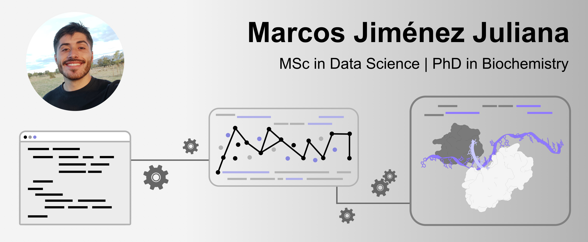

# 🙋🏻‍♂️ Welcome to my Data Science Portfolio! 

Hello, I'm Marcos. I am a passionate scientist with more than 5 years of research experience recently graduated as PhD in Biochemistry. 

My research has awakened my interest in the world of Data Science. I am currently enrolled in an online MSc in Data Science and I want to share some of the projects I am working on here. I hope you enjoy reading the projects as much as I did creating them :).

<em> "The most powerful algorithm is a curious mind". </em> 

### 📚 My Projects

Checkout my portfolio, where I showcase my [projects](https://github.com/mjimenezj/Portfolio/blob/main/Projects/README.md).

Checkout my portfolio, where I showcase my [test](https://mjimenezj.github.io/Portfolio/Projects.html).

### 🛠️ Tools I am Skilled in

- Programming Languages: Python, SQL, LaTeX.
- Data Preprocessing: outliers detection, feature scaling & dimensionality reduction.
- Skilled in: Pandas, Numpy, Scikit-learn, Matplotlib, Seaborn.
- Machine Learning Algorithms: Linear and Logistic Regressions, Naive Bayes, SVM, KNN, Softmax, Decision Trees, K-Means clustering.
- Databases: PostgreSQL, MySQL, MongoDB.
- Others: Linux, Git, API REST.
- Structural Biology Software: Chimera X, AlphaFold 3, ProteinMPNN, RosettaFoldDifussion. 

### 🧬 My Scientific Publications

Despite most of my research has not been published yet, let me share with you my first research article:

- Jiménez-Juliana, M., Martínez-Jiménez, M. I., & Blanco, L. (2024). Remdesivir triphosphate is a valid substrate to initiate synthesis of DNA primers by human PrimPol. *DNA repair*, 143, 103772 (Elsevier). [https://doi.org/10.1016/j.dnarep.2024.103772](https://doi.org/10.1016/j.dnarep.2024.103772)

### 👋🏻 Connect with Me

- [LinkedIn](https://www.linkedin.com/in/marcos-jimenez-juliana/)

