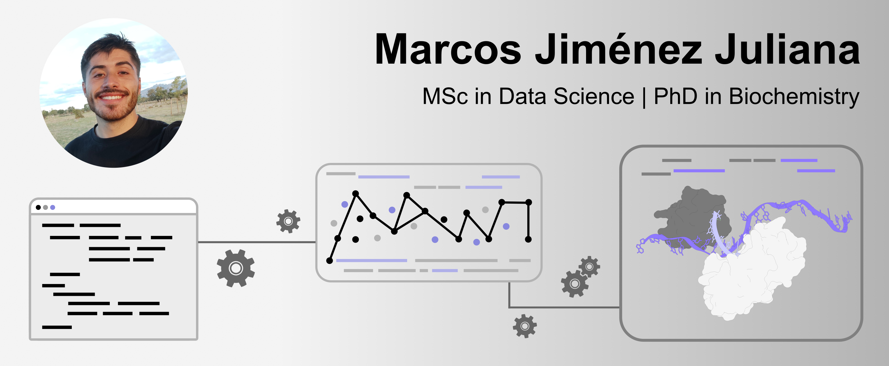

# 🙋🏻‍♂️ Welcome to my Data Science Portfolio! 

Hello, I'm Marcos. I am a passionate scientist with extensive experience in Academic Research and Industry, combining rigorous Analytical Thinking with a strong focus on delivering Practical Solutions to real-world problems.

I would like to share some of the projects I have created in my free time for learning purposes. I hope you enjoy reading the projects as much as I did creating them :).

### 📚 My Projects

Checkout my portfolio, where I showcase my [Projects](https://mjimenezj.github.io/Portfolio/Projects.html).

### 🛠️ Tools I am Skilled in

- Programming Languages: Python, R, Bash, SQL, LaTeX.
- Data Preprocessing: outliers detection, feature scaling & dimensionality reduction.
- Skilled in: Pandas, Numpy, Scikit-learn, Matplotlib, Seaborn, TensorFlow.
- Machine Learning Algorithms: Linear and Logistic Regressions, Naive Bayes, SVM, KNN, Softmax, Decision Trees, K-Means clustering, Random Forest, XGBoost, LightGBM, CatBoost, PCA, SHAP.
- Databases: PostgreSQL, MySQL, MongoDB.
- Others: Git, Linux, PowerBI.
- Structural Biology Software: PyMol, Chimera X, AlphaFold 3, ESMFold, OMEGAFold, ProteinMPNN, LigandMPNN, RosettaFoldDiffusion. 

### 🧬 My Scientific Publications

Despite most of my research has not been published yet, let me share with you my first research article and my doctoral thesis:

- Jiménez-Juliana, M., Martínez-Jiménez, M. I., & Blanco, L. (2024). Remdesivir triphosphate is a valid substrate to initiate synthesis of DNA primers by human PrimPol. *DNA repair*, 143, 103772 (Elsevier). [https://doi.org/10.1016/j.dnarep.2024.103772](https://doi.org/10.1016/j.dnarep.2024.103772)

- Jiménez-Juliana, M. (2025). Modelling the priming mechanism of human PrimPol based on experimental data and AI-predicted structures. *Doctoral Thesis* (Universidad Autónoma de Madrid). [Government Repository](https://aplicaciones.ciencia.gob.es/teseo/#/tesis/O863124/detalle); [University Repository](https://repositorio.uam.es/entities/publication/63c52104-245e-45ce-a7ac-7af02e1885ff).

### 👋🏻 Connect with Me

- [LinkedIn](https://www.linkedin.com/in/marcos-jimenez-juliana/)

